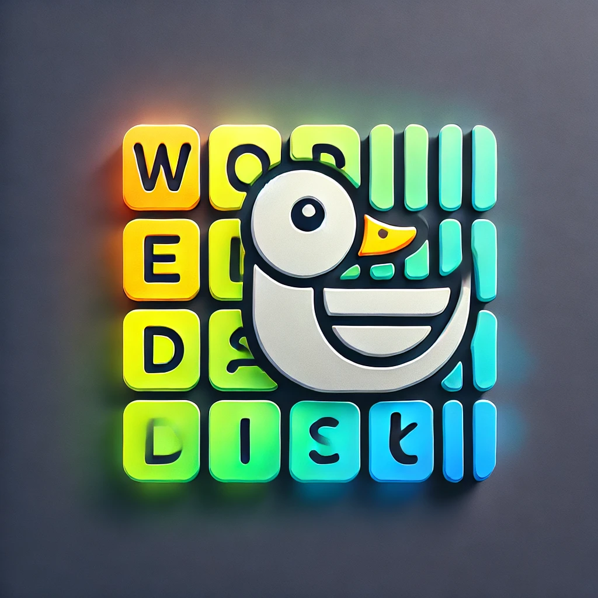

# Georgia-AI
A machine learning AI that looks at a set of wordle results for a given day and tries to infer that days word given how people guessed.

## Overview
We give our bot an input representing several wordle results (the format shown below). We return a probability ditributed over the five letter words, giving the most likely words for that day.

```angular2html
Day 999 5/6
⬜⬜⬜🟨🟨
🟨🟨⬜⬜⬜
⬜🟩🟩🟩🟩
⬜🟩🟩🟩🟩
🟩🟩🟩🟩🟩
```

## Setup your venv:
Download python 3.7 if you only have higher versions installed. Or use your older version, so long as it is supported by pytorch
```angular2html
python3.7 -m venv env3.7
source evn3.7/bin/activate
```
then in your env
```angular2html
pip3 install torch
```

## Processing the data

If you want to add to the data or replicate the process, here are the steps:

- Export whatsapp chat without media
- Rename the file to all-messages and put it under ```/data```
- Run:
```angular2html
cd processing-scripts
```

## Input and Output structure

## The model

## Training

## Accuracy
24.64% best 